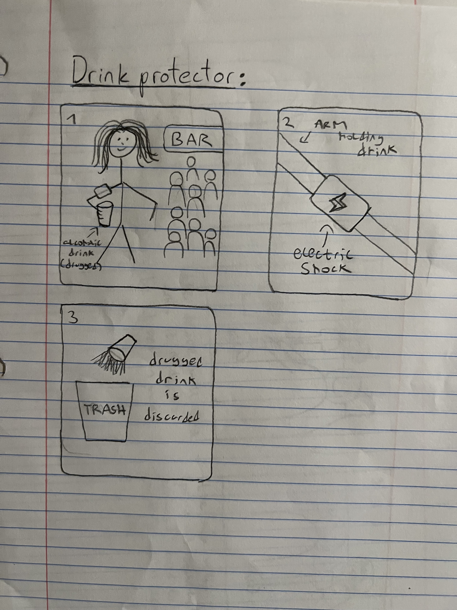
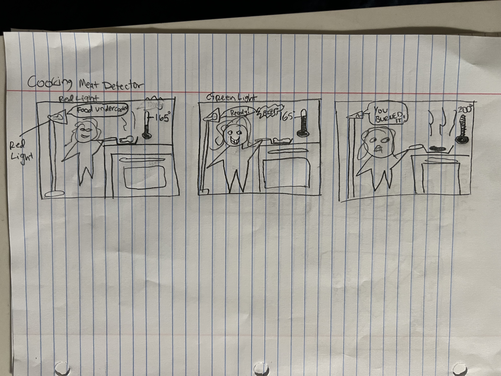
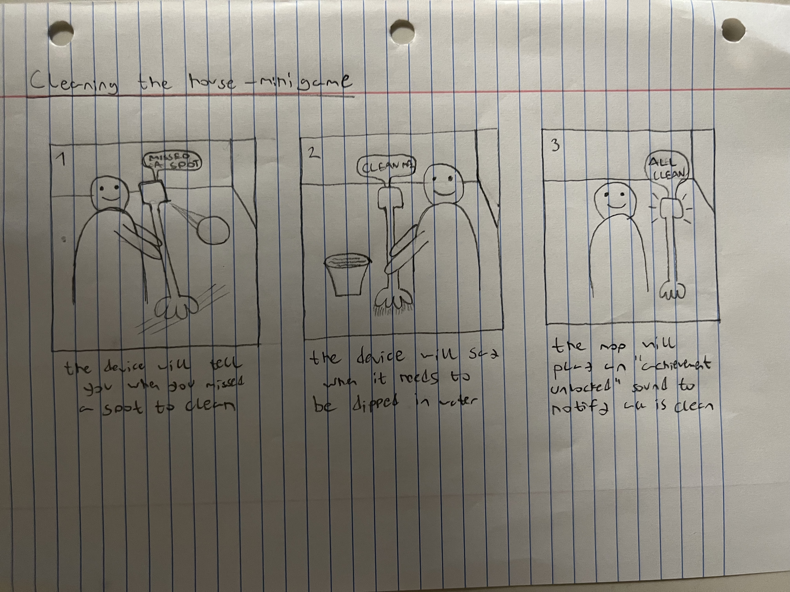
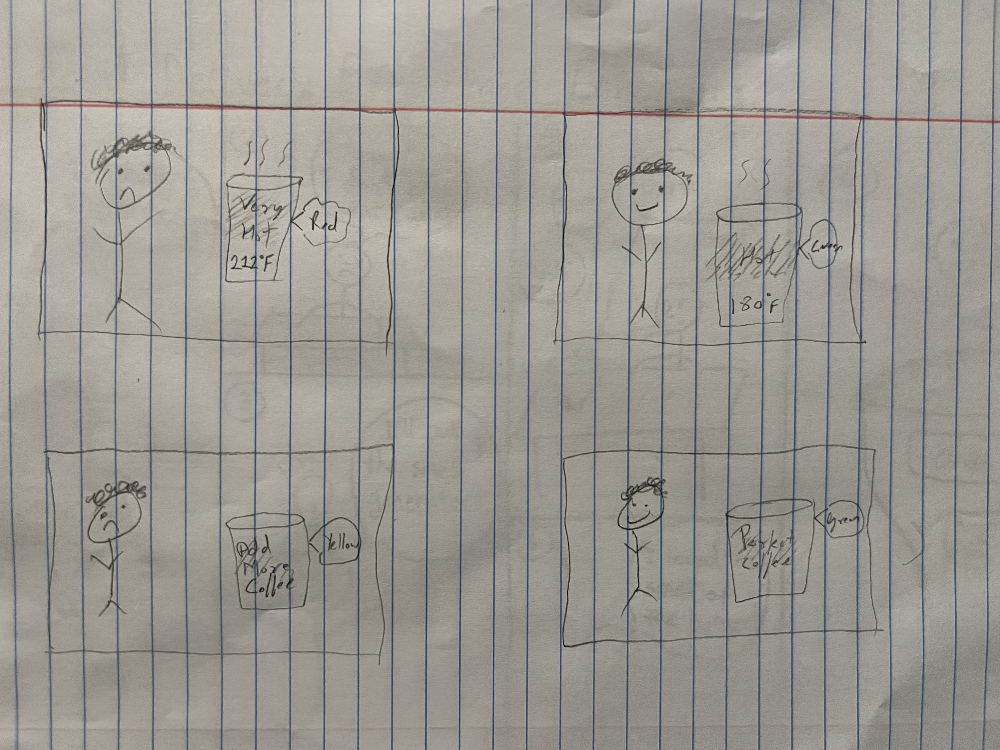

# Staging Interaction

**Collaborators: Carlos Suberviola, Ivan Nikitovic, and Neelraj Patil**
<!---
In the original stage production of Peter Pan, Tinker Bell was represented by a darting light created by a small handheld mirror off-stage, reflecting a little circle of light from a powerful lamp. Tinkerbell communicates her presence through this light to the other characters. See more info [here](https://en.wikipedia.org/wiki/Tinker_Bell). 

There is no actor that plays Tinkerbell--her existence in the play comes from the interactions that the other characters have with her.

For lab this week, we draw on this and other inspirations from theatre to stage interactions with a device where the main mode of display/output for the interactive device you are designing is lighting. You will plot the interaction with a storyboard, and use your computer and a smartphone to experiment with what the interactions will look and feel like. 

_Make sure you read all the instructions and understand the whole of the laboratory activity before starting!_

## Prep

### To start the semester, you will need:
1. Read about Git [here](https://git-scm.com/book/en/v2/Getting-Started-What-is-Git%3F).
2. Set up your own Github "Lab Hub" repository to keep all you work in record by [following these instructions](https://github.com/FAR-Lab/Developing-and-Designing-Interactive-Devices/blob/2021Fall/readings/Submitting%20Labs.md).
3. Set up the README.md for your Hub repository (for instance, so that it has your name and points to your own Lab 1) and [learn how to](https://guides.github.com/features/mastering-markdown/) organize and post links to your submissions on your README.md so we can find them easily.

### For this lab, you will need:
1. Paper
2. Markers/ Pens
3. Scissors
4. Smart Phone -- The main required feature is that the phone needs to have a browser and display a webpage.
5. Computer -- We will use your computer to host a webpage which also features controls.
6. Found objects and materials -- You will have to costume your phone so that it looks like some other devices. These materials can include doll clothes, a paper lantern, a bottle, human clothes, a pillow case, etc. Be creative!

### Deliverables for this lab are: 
1. 7 Storyboards
1. 3 Sketches/photos of costumed devices
1. Any reflections you have on the process
1. Video sketch of 3 prototyped interactions
1. Submit the items above in the lab1 folder of your class [Github page], either as links or uploaded files. Each group member should post their own copy of the work to their own Lab Hub, even if some of the work is the same from each person in the group.

### The Report
This README.md page in your own repository should be edited to include the work you have done (the deliverables mentioned above). Following the format below, you can delete everything but the headers and the sections between the **stars**. Write the answers to the questions under the starred sentences. Include any material that explains what you did in this lab hub folder, and link it in your README.md for the lab.
!--->
## Lab Overview

A) [Plan](#part-a-plan) 

B) [Act out the interaction](#part-b-act-out-the-interaction) 

C) [Prototype the device](#part-c-prototype-the-device)

D) [Wizard the device](#part-d-wizard-the-device) 

E) [Costume the device](#part-e-costume-the-device)

F) [Record the interaction](#part-f-record)

## Part A. Plan 

\*\***Describe your setting, players, activity and goals here.**\*\*

Picture this — a lone pianist on an otherwise silent stage, prepared to perform in front of a small audience at a local New York City bar. It is a Saturday night and the pianist has prepared a set aimed to please everyone; a few songs from each genre. Ignoring the sight of the crowd, the musician pretends sits alone with his piano, focusing only on the task at hand. He thinks, "How might I make myself stand out in a city of talented people?"

The musician decides to use light to enhance his performance, adding a visual experience to an otherwise auditory performance. Turning on a projector, the pianist enables the VibeCheck app, created by four Cornell Tech students. Upon starting his set, the projector, acting as a DJ, displays a scene onto the piano and the pianist plays a song to match it. Starting with a Blues classic, the projector paints the piano and the player in a mosaic of blue tiles, suggesting to the player that the audience wants a blues classic. Later with Rock and Roll, the projector changes to a more upbeat scene, displaying black and red colors, commonly associated with the genre. The projector serves to amplify the musical experience, suggesting how to keep the audience engaged and forecasting how the scene will change next.

\*\***Include pictures of your storyboards here**\*\*  
Please disregard the storyboard numbers on the image. Our storyboards represent different uses of light interaction surrounding the same piano theme. 

***Selected -** Storyboard 1: Music Vibe Check* \
The following images were partially generated by OpenAI's DALLE \

*Storyboard 2: A Piano Tuner* \
The following images were partially generated by OpenAI's DALLE \

*Storyboard 3: Tempo Checker*  

*Storyboard 4: Hot or Cold*  
  

*Storyboard 5: Genre*  
  

*Storyboard 6: Chord Detector*  
  

*Storyboard 7: Piano Teacher*  
  

\*\***Summarize feedback you got here.**\*\*  
The main feedback we got was that the idea using the projector would be the most immersive and creative. The other ideas using the phone didn't seem to have as much of a visual impact on the scene.

## Part B. Act out the Interaction

Try physically acting out the interaction you planned. For now, you can just pretend the device is doing the things you’ve scripted for it.  
Our piano player changed genres when the "DJ" flashed the light.  
[Video](https://drive.google.com/file/d/1n2bn9h6-RctrIRcpJd2N5-sUjcy3IfTY/view?usp=drivesdk)

\*\***Are there things that seemed better on paper than acted out?**\*\*
Since we have not looked at the Tinkerbelle app yet, it may not be as easy as we thought to create the scene with the DJ projector. We want to do something more than just a single color to set the mood.

\*\***Are there new ideas that occur to you or your collaborators that come up from the acting?**\*\*  
We decided to add animated backgrounds instead of static colors and we integrated this within the Tinkerbelle app. We thought this would be a more obvious way to signal that the DJ wants a genre transition.  

## Part C. Prototype the device

<!-- You will be using your smartphone as a stand-in for the device you are prototyping. You will use the browser of your smart phone to act as a “light” and use a remote control interface to remotely change the light on that device. 

Code for the "Tinkerbelle" tool, and instructions for setting up the server and your phone are [here](https://github.com/FAR-Lab/tinkerbelle).

We invented this tool for this lab! 

If you run into technical issues with this tool, you can also use a light switch, dimmer, etc. that you can can manually or remotely control. -->

\*\***Give us feedback on Tinkerbelle.**\*\* \
Set up instructions were easy to follow and the color changing has a low latency. Since we plan to use animated textures, we modified the code to allow selecting pre-uploaded GIFs.

## Part D. Wizard the device
Take a little time to set up the wizarding set-up that allows for someone to remotely control the device while someone acts with it. Hint: You can use Zoom to record videos, and you can pin someone’s video feed if that is the scene which you want to record. 

\*\***Include your first attempts at recording the set-up video here.**\*\*
Attempt using single color changing with Tinkerbelle app  
 [Attempt](https://drive.google.com/file/d/1Dx2rSeveBNBlT-BBi9_VxBzZMMlvx_eq/view?usp=drivesdkx)  

Now, change the goal within the same setting, and update the interaction with the paper prototype. 

\*\***Show the follow-up work here.**\*\*  
Adding in the GIFs  

[GIF Projected](https://drive.google.com/file/d/1Qc-t5EvsV8UDbPcp2JdbQyVkc1g_9kw_/view?usp=sharing)  

## Part E. Costume the device

\*\***Include sketches of what your devices might look like here.**\*\* \
*Scrolling Customizable LED Display Board*\
   

*Old Style Metronome*\
   

*Selected: DJ Projector*  
 

\*\***What concerns or opportunitities are influencing the way you've designed the device to look?**\*\* \
Since the projector has ventilation in the back and projects light from the front, we cannot have a costume that covers either of the sides of the device.

## Part F. Record

\*\***Take a video of your prototyped interaction.**\*\*  
[Video of Prototype](https://drive.google.com/file/d/1r2ackO6KHVYIbQu3fWM3Rz4h4dXIjIj_/view?usp=sharing)  

\*\***Please indicate anyone you collaborated with on this Lab.**\*\* \
We modified the Tinkerbelle code to work with remotely selected GIFs to match the intention of our project. ChatGPT was used to help adjust Tinkerbelle code.

# Staging Interaction, Part 2 

This describes the second week's work for this lab activity.

## Prep (to be done before Lab on Wednesday)

You will be assigned three partners from another group. Go to their github pages, view their videos, and provide them with reactions, suggestions & feedback: explain to them what you saw happening in their video. Guess the scene and the goals of the character. Ask them about anything that wasn’t clear. 

\*\***Summarize feedback from your partners here.**\*\*
Great usage of light and music but storyboards could have been different. Above and beyond! Easy to understand except that the setup video was a little confusing.

## Make it your own

Do last week’s assignment again, but this time: 
1) It doesn’t have to (just) use light, 
2) You can use any modality (e.g., vibration, sound) to prototype the behaviors! Again, be creative! Feel free to fork and modify the tinkerbell code! 
3) We will be grading with an emphasis on creativity. 

\*\***Document everything here. (Particularly, we would like to see the storyboard and video, although photos of the prototype are also great.)**\*\*

## Part A. Plan 

\*\***Describe your setting, players, activity and goals here.**\*\*

Picture this — a lone pianist on an otherwise silent stage, prepared to perform in front of a small audience at a local New York City restaurant. It is a Saturday night and the pianist has no idea what song will elicit the most emotion. Fortunately, the restaurant our performer is playing at has been equipped with VibeCheck, a new technology created by four Cornell Tech students. VibeCheck is a device that sits on a table, reading the brain activity of those seated and detecting their emotional response to the music being played. VibeCheck interacts with smart devices, enhancing the scene in a multi-sensory fashion. For example, while playing a Portuguese Fado classic, VibeCheck will project pictures of Portugal's beautiful landscapes and activate smalls of Pastéis de Nata. After the night ends, the restaurant will receive a score on how well the musician elicited emotion from the audience. 

\*\***Include pictures of your storyboards here**\*\*  
Other ideas

**Storyboard 1: Music Vibe Check* \
  
**Storyboard 2: Drugged Drink Detector* \
  
**Storyboard 3: Food Poisoning Detector* \
  
**Storyboard 4: Food Cooking Detector* \
  
**Storyboard 5: Clean the House Minigame* \
  
**Storyboard 6: Food Delivery Experience* \
  
**Storyboard 7: Caffeine Intake Detector* \

\*\***Summarize feedback you got here.**\*\*  
Based on our first part, people enjoyed the music aspect. VibeCheck V2 was the most appreciated idea, as it incorporates a multi-sensory experience.

## Part B. Act out the Interaction

Try physically acting out the interaction you planned. For now, you can just pretend the device is doing the things you’ve scripted for it.  
Showing basic interaction with the scene and the patron at the table. 

[Video](https://drive.google.com/file/d/1fNQFmfe-QBoDJTrAXYwVVwk9E37RM_Xz/view?usp=sharing)

\*\***Are there things that seemed better on paper than acted out?**\*\*
Since we can only simulate the multi-sensory experience and cannot trigger non-visual senses for someone watching the video, we are limited in the impact of our recording.  
\*\***Are there new ideas that occur to you or your collaborators that come up from the acting?**\*\*  
We decided to create more variety of scenes, such as using vastly different genres to try and elicit strong emotional responses. We also had the actor display visible emotion to make it more obvious what the device is doing.   

## Part C. Prototype the device

<!-- You will be using your smartphone as a stand-in for the device you are prototyping. You will use the browser of your smart phone to act as a “light” and use a remote control interface to remotely change the light on that device. 

Code for the "Tinkerbelle" tool, and instructions for setting up the server and your phone are [here](https://github.com/FAR-Lab/tinkerbelle).

We invented this tool for this lab! 

If you run into technical issues with this tool, you can also use a light switch, dimmer, etc. that you can can manually or remotely control. -->

\*\***Give us feedback on Tinkerbelle.**\*\* \
We did not use Tinkerbelle for this second part of the lab, as it was not necessary or reasonably linkable to our smart devices, such as the oil diffuser.

## Part D. Wizard the device
Take a little time to set up the wizarding set-up that allows for someone to remotely control the device while someone acts with it. Hint: You can use Zoom to record videos, and you can pin someone’s video feed if that is the scene which you want to record. 

\*\***Include your first attempts at recording the set-up video here.**\*\*
We attempted a single background and panned the camera around the "restaurant" to show the whole scene. 
 [Attempt 1](https://drive.google.com/file/d/1fNQFmfe-QBoDJTrAXYwVVwk9E37RM_Xz/view?usp=sharing)  

Now, change the goal within the same setting, and update the interaction with the paper prototype. 

\*\***Show the follow-up work here.**\*\*  
Now we showed the person at the table interacting in a subtle way. In this case, he is sipping tea and not showing extreme emotion that implies he loves or hates the song. In the final video, this actor will elicit more obvious emotion to show whether or not he enjoys the music being played and the ambiance around it.

[Actor with props](https://drive.google.com/file/d/17U6_eNxjuPq2pQbxH1G9NLfaRdCHJ4KI/view?usp=sharing)  

## Part E. Costume the device

\*\***Include sketches of what your devices might look like here.**\*\* \
*Design Options*\
   

\*\***What concerns or opportunitities are influencing the way you've designed the device to look?**\*\* \
Since our device relies on technology that isn't easily accessible (medical devices that read brain activity) we wanted to use more creativity to make the device blend in, rather than obviously being the type of device it is. Therefore, given the dimly lit restaurant environment, we decided to use the projector/vibe reading device as a stand for a candle. 

## Part F. Record

\*\***Take a video of your prototyped interaction.**\*\*  
[Video of Prototype](https://drive.google.com/file/d/18hq74xevs4q34luBC3xE5fJ1Ij22pFLc/view?usp=sharing)  

\*\***Please indicate anyone you collaborated with on this Lab.**\*\*

