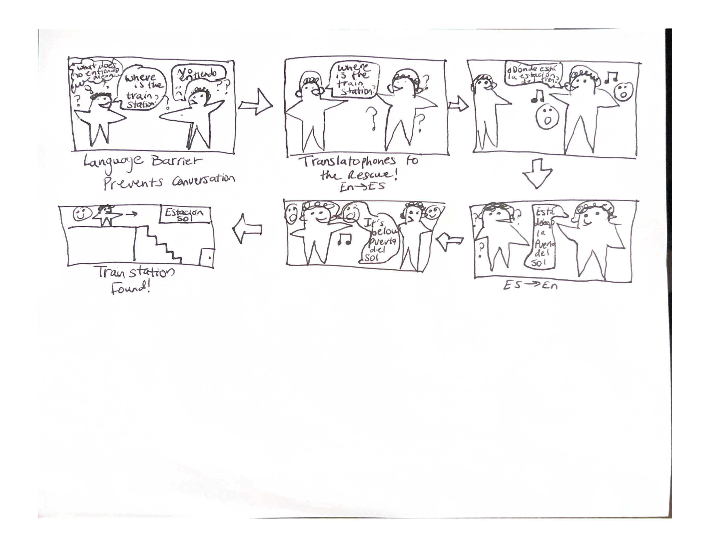
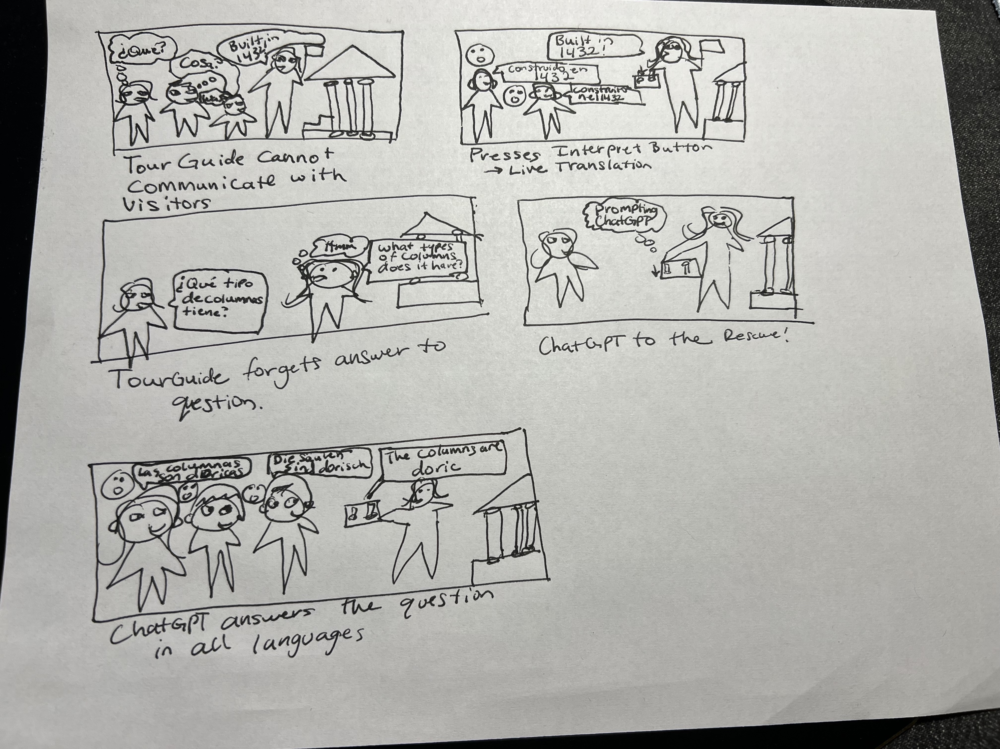

# Chatterboxes
**Collaborators: Zachary Pakin, Carlos Suberviola, Ivan Nikitovic**

[We used ChatGPT to help with Python input from CLI](https://chat.openai.com/share/81da0c38-cd3d-402d-b521-188989bfccf7)  

[We also used ChatGPT for other tasks](https://chat.openai.com/share/667095da-feeb-4c7f-8fa9-c408e52f9a9b)

[We used the Python translate library for Google Translate integration to the app](https://pypi.org/project/translate/)  
<!-- [](https://www.youtube.com/embed/Q8FWzLMobx0?start=19)

In this lab, we want you to design interaction with a speech-enabled device--something that listens and talks to you. This device can do anything *but* control lights (since we already did that in Lab 1).  First, we want you first to storyboard what you imagine the conversational interaction to be like. Then, you will use wizarding techniques to elicit examples of what people might say, ask, or respond.  We then want you to use the examples collected from at least two other people to inform the redesign of the device.

We will focus on **audio** as the main modality for interaction to start; these general techniques can be extended to **video**, **haptics** or other interactive mechanisms in the second part of the Lab. -->

## Prep for Part 1: Get the Latest Content and Pick up Additional Parts 
<!-- 
### Pick up Web Camera If You Don't Have One

Students who have not already received a web camera will receive their [IMISES web cameras](https://www.amazon.com/Microphone-Speaker-Balance-Conference-Streaming/dp/B0B7B7SYSY/ref=sr_1_3?keywords=webcam%2Bwith%2Bmicrophone%2Band%2Bspeaker&qid=1663090960&s=electronics&sprefix=webcam%2Bwith%2Bmicrophone%2Band%2Bsp%2Celectronics%2C123&sr=1-3&th=1) on Thursday at the beginning of lab. If you cannot make it to class on Thursday, please contact the TAs to ensure you get your web camera. 

**Please note:** connect the webcam/speaker/microphone while the pi is *off*. 

### Get the Latest Content

As always, pull updates from the class Interactive-Lab-Hub to both your Pi and your own GitHub repo. There are 2 ways you can do so:

**\[recommended\]**Option 1: On the Pi, `cd` to your `Interactive-Lab-Hub`, pull the updates from upstream (class lab-hub) and push the updates back to your own GitHub repo. You will need the *personal access token* for this.

```
pi@ixe00:~$ cd Interactive-Lab-Hub
pi@ixe00:~/Interactive-Lab-Hub $ git pull upstream Fall2022
pi@ixe00:~/Interactive-Lab-Hub $ git add .
pi@ixe00:~/Interactive-Lab-Hub $ git commit -m "get lab3 updates"
pi@ixe00:~/Interactive-Lab-Hub $ git push
```

Option 2: On your your own GitHub repo, [create pull request](https://github.com/FAR-Lab/Developing-and-Designing-Interactive-Devices/blob/2022Fall/readings/Submitting%20Labs.md) to get updates from the class Interactive-Lab-Hub. After you have latest updates online, go on your Pi, `cd` to your `Interactive-Lab-Hub` and use `git pull` to get updates from your own GitHub repo. -->

## Part 1.
### Setup 
<!-- 
*DO NOT* forget to work on your virtual environment! 

Run the setup script
```chmod u+x setup.sh && sudo ./setup.sh  ```

### Text to Speech 

In this part of lab, we are going to start peeking into the world of audio on your Pi! 

We will be using the microphone and speaker on your webcamera. In the directory is a folder called `speech-scripts` containing several shell scripts. `cd` to the folder and list out all the files by `ls`:

```
pi@ixe00:~/speech-scripts $ ls
Download        festival_demo.sh  GoogleTTS_demo.sh  pico2text_demo.sh
espeak_demo.sh  flite_demo.sh     lookdave.wav
```

You can run these shell files `.sh` by typing `./filename`, for example, typing `./espeak_demo.sh` and see what happens. Take some time to look at each script and see how it works. You can see a script by typing `cat filename`. For instance:

```
pi@ixe00:~/speech-scripts $ cat festival_demo.sh 
#from: https://elinux.org/RPi_Text_to_Speech_(Speech_Synthesis)#Festival_Text_to_Speech
```
You can test the commands by running
```
echo "Just what do you think you're doing, Dave?" | festival --tts
```

Now, you might wonder what exactly is a `.sh` file? 
Typically, a `.sh` file is a shell script which you can execute in a terminal. The example files we offer here are for you to figure out the ways to play with audio on your Pi!

You can also play audio files directly with `aplay filename`. Try typing `aplay lookdave.wav`. -->

\*\***Write your own shell file to use your favorite of these TTS engines to have your Pi greet you by name.**\*\*  
[Shell Script for Greeting](speech-scripts/greeting.sh)  
[Audio Output](speech-scripts/greeting.wav)

<!-- ---
Bonus:
[Piper](https://github.com/rhasspy/piper) is another fast neural based text to speech package for raspberry pi which can be installed easily through python with:
```
pip install piper-tts
```
and used from the command line. Running the command below the first time will download the model, concurrent runs will be faster. 
```
echo 'Welcome to the world of speech synthesis!' | piper \
  --model en_US-lessac-medium \
  --output_file welcome.wav
```
Check the file that was created by running `aplay welcome.wav`. Many more languages are supported and audio can be streamed dirctly to an audio output, rather than into an file by:

```
echo 'This sentence is spoken first. This sentence is synthesized while the first sentence is spoken.' | \
  piper --model en_US-lessac-medium --output-raw | \
  aplay -r 22050 -f S16_LE -t raw -
``` -->
  
### Speech to Text

<!-- Next setup speech to text. We are using a speech recognition engine, [Vosk](https://alphacephei.com/vosk/), which is made by researchers at Carnegie Mellon University. Vosk is amazing because it is an offline speech recognition engine; that is, all the processing for the speech recognition is happening onboard the Raspberry Pi. 
```
pip install vosk
pip install sounddevice
```

Test if vosk works by transcribing text:

```
vosk-transcriber -i recorded_mono.wav -o test.txt
```

You can use vosk with the microphone by running 
```
python test_microphone.py -m en
``` -->

\*\***Write your own shell file that verbally asks for a numerical based input (such as a phone number, zipcode, number of pets, etc) and records the answer the respondent provides.**\*\*  
[Script](speech-scripts/numerical_input.sh)


<!-- ### Serving Pages

In Lab 1, we served a webpage with flask. In this lab, you may find it useful to serve a webpage for the controller on a remote device. Here is a simple example of a webserver.

```
pi@ixe00:~/Interactive-Lab-Hub/Lab 3 $ python server.py
 * Serving Flask app "server" (lazy loading)
 * Environment: production
   WARNING: This is a development server. Do not use it in a production deployment.
   Use a production WSGI server instead.
 * Debug mode: on
 * Running on http://0.0.0.0:5000/ (Press CTRL+C to quit)
 * Restarting with stat
 * Debugger is active!
 * Debugger PIN: 162-573-883
```
From a remote browser on the same network, check to make sure your webserver is working by going to `http://<YourPiIPAddress>:5000`. You should be able to see "Hello World" on the webpage. -->

### Storyboard

Storyboard and/or use a Verplank diagram to design a speech-enabled device. (Stuck? Make a device that talks for dogs. If that is too stupid, find an application that is better than that.) 

   


Write out what you imagine the dialogue to be. Use cards, post-its, or whatever method helps you develop alternatives or group responses. 

\*\***Please describe and document your process.**\*\*

The program works by providing instructions to each participant in the intended language. With the suggested speech to text library, it is important to set a time limit on the input, as it does not time out on its own. Additioanlly, I modified the program to only output complete (confident) results, instead of partial text matches. 

The below dialog assumes that the text input is heard correctly.  

Device: You will have 8 seconds to record a single phrase to be translated. You must speak continuously in English. You may begin after the beep.

Human 1: Hello! How are you?

Device: ¡Hola! ¿Qué tal?

Device: Vas a tener 8 segundos para grabar una respuesta que será traducida al inglés. Tienes que hablar continuamente en español. Empieza después del tono.

Human 2: Estoy triste porque quiero volver a España

Device: I am Trieste because I want .

Failing Example 1: This example assumes that the speech to text engine does not properly transcribe the voice input. 

Device: You will have 8 seconds to record a single phrase to be translated. You must speak continuously in English. You may begin after the beep.

Human 1: Hello! How are you?

Device: ¡Hola! ¿Qué tal?

Device: Vas a tener 8 segundos para grabar una respuesta que será traducida al inglés. Tienes que hablar continuamente en español. Empieza después del tono.

Human 2: Estoy triste porque quiero volver a España

*What the device understood: Estoy triste porque quiero volver a las canas*

Device: I am sad because I want to go back to the grey hairs.

Failing Example 2: This example assumes that the Google Translate API used by the Python translator returns an incorrect translation.

Device: You will have 8 seconds to record a single phrase to be translated. You must speak continuously in English. You may begin after the beep.

Human 1: Hello! What is your favorite Spanish idiom?

Device: ¡Hola! ¿Cuál es tu modismo español favorito?

Device: Vas a tener 8 segundos para grabar una respuesta que será traducida al inglés. Tienes que hablar continuamente en español. Empieza después del tono.

Human 2: Estar más sano que una pera.

Device: To be healthier than a pear.  
*Although this is a correct literal translation, it is not well done, as it does not express the same idiomatic meaning.*
### Acting out the dialogue

[Video of interacting with the device](https://drive.google.com/file/d/1oXMzCklz0qACpULA0jEq0wlHPUKeR9x2/view?usp=sharing)  
*In the video, since the audio goes through the headphones, I overlayed what was heard by Carlos. Carlos is acting as two people: an English speaker and a Spanish speaker*  

Find a partner, and *without sharing the script with your partner* try out the dialogue you've designed, where you (as the device designer) act as the device you are designing.  Please record this interaction (for example, using Zoom's record feature).

\*\***Describe if the dialogue seemed different than what you imagined when it was acted out, and how.**\*\*

Due to the time needed to process the translation and create the text to speech, there is a bit of an unnatural pause after finishing one's sentence and hearing the translation. Also, since we were simulating a conversation between two people, it was a bit unnatural to have only one person doing the demo (but this was needed do to lack of equipment/and was a proof of concept).  

<!-- ### Wizarding with the Pi (optional)
In the [demo directory](./demo), you will find an example Wizard of Oz project. In that project, you can see how audio and sensor data is streamed from the Pi to a wizard controller that runs in the browser.  You may use this demo code as a template. By running the `app.py` script, you can see how audio and sensor data (Adafruit MPU-6050 6-DoF Accel and Gyro Sensor) is streamed from the Pi to a wizard controller that runs in the browser `http://<YouPiIPAddress>:5000`. You can control what the system says from the controller as well!

\*\***Describe if the dialogue seemed different than what you imagined, or when acted out, when it was wizarded, and how.**\*\* -->

# Lab 3 Part 2

For Part 2, you will redesign the interaction with the speech-enabled device using the data collected, as well as feedback from part 1.

## Prep for Part 2

1. What are concrete things that could use improvement in the design of your device? For example: wording, timing, anticipation of misunderstandings...  

The timing of the Part 1 prototype has a bit of awkward timing, as the translation engine and text to speech take longer than apps we are familiar with (like Google Translate). Also, given that the voice to text engine is not very accurate, the translation could make little sense/not match the original phrase. Finally, since the Part 1 implementation uses a timer to cut off input, that can be awkward for short or long phrases (currently set at 8 seconds for cutoff)    
2. What are other modes of interaction _beyond speech_ that you might also use to clarify how to interact?  
We want to take advantage of button input rather than artifically starting a script that is bound by input time. We could also add instructions/the live translation to the display for a visual signal.  

3. Make a new storyboard, diagram and/or script based on these reflections.
  

## Prototype your system

The system should:
* use the Raspberry Pi 
* use one or more sensors
* require participants to speak to it. 

*Document how the system works*  
Our Python script uses the voice to text library, expecting English input from the tour guide. One of the two buttons is our input sensor being used. After the input is complete, the Python translation library we are using translates the phrase into the target langauge (currently set to Spanish) and then reads out the translated phrase using the text to speech library (with Spanish lang pack). To demonstrate a tour attendee asking a question back to the tour guide, the program then allows the non-English speaking attendee to speak in their language which is then translated and read out to the tour guide in English. Since tour guides can't remember everything, we added a ChatGPT feature that only the tour guide can access. The tour guide can press the other button on their device to have their speech transcribed, crafted into a prompt, and sent to ChatGPT for a response. The response from GPT is then translated for the attendees and read to them in their preferred language. GPT will speak from the perspective of the tourguide, to prevent embarassing them for not knowing a detail of the tour.  

*Include videos or screencaptures of both the system and the controller.*

## Test the system
Try to get at least two people to interact with your system. (Ideally, you would inform them that there is a wizard _after_ the interaction, but we recognize that can be hard.)

Answer the following:

### What worked well about the system and what didn't?
The GPT feature generally worked well, answering questions in a short amount of time and working decently for our use case. Additionally, the text to speech library worked well with transcribing our text. However, the speech to text library suggested frequently made mistakes and misunderstood basic statements, which therefore made the translation incorrect. 

### What worked well about the controller and what didn't?

Since we used the buttons to control the transcription and translation mode, there were no errors with that aspect of the controller. However, since there was some wizarding involved and no directions were spoken/shown on the screen, a user would struggle to take advantage of the GPT & translation feature without knowing the button mappings or having the terminal output that the "wizards" had. Also, since translation and transcription libraries were involved, there were delays that were below industry standard (Google Translate and ChatGPT) and slightly awkward

### What lessons can you take away from the WoZ interactions for designing a more autonomous version of the system?

Since our program is fully functional, the only wizarding invovled was providing indications to the user of which buttons to push for the desired feature. Therefore, we would only need to add an instructions screen or voice recording to replace our wizarding. As a general lesson, we learned that it is important to think of this before starting, rather than waiting until the end and needing to add signals of interaction. 


### How could you use your system to create a dataset of interaction? What other sensing modalities would make sense to capture?

Since our system has the use case of guided tours and calls to chatGPT cost money, it would make sense to potentially cache information from each tour, such that if the information has already been gathered, it can be recalled on further tours. Additionally, perhaps instead of using the buttons, there could be an activation phrase like Hey Siri for the device to listen to what information is needed. The device could also utilize a GPS to automatically provide background information on a site in various languages depending on where the visitors are. 
