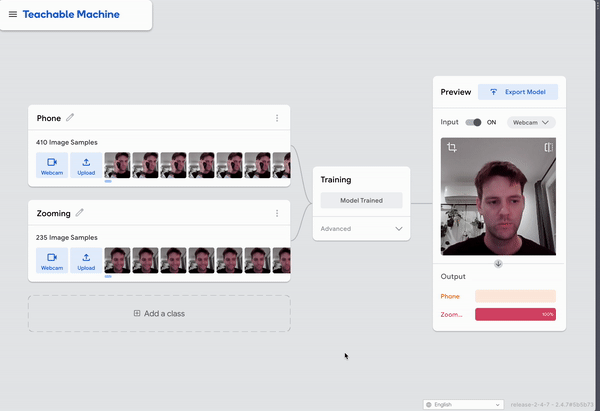
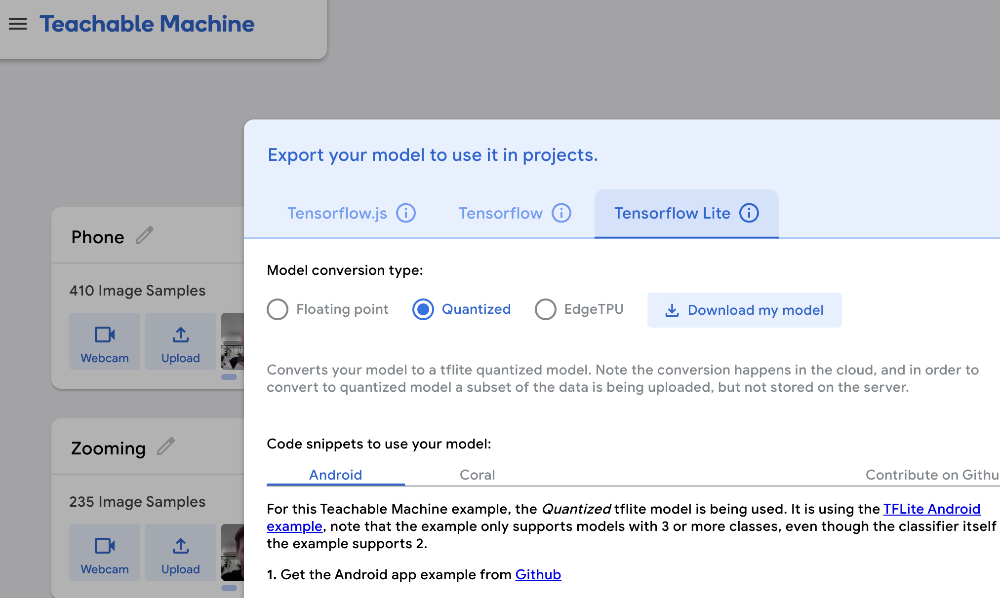

# Observant Systems

**NAMES OF COLLABORATORS HERE**: Carlos Suberviola, Neelraj Patil, Ivan Nikitovic

ChatGPT was used to choose random milestone images and assign them to an emotion. It was also used for uplifting messages. 
```
mood_to_images = {
    "happy": [
        "mewithfriends.jpg",  # Social gatherings often boost happiness.
        "puppy.jpg",          # Cute animals are a common source of joy.
        "graduation.jpg",     # Celebrating personal achievements can make someone happy.
        "birthday_party.jpg", # Birthday celebrations are typically joyous occasions.
        "concert_night.jpg",  # Music events are often associated with happiness and excitement.
        "baby_steps.jpg",     # Family milestones like a baby's first steps bring happiness.
    ],
    "sad": [
        # Typically, one does not seek to view images to enhance sadness, but certain images might offer comfort during sadness.
        "puppy.jpg",          # Pets can provide comfort during sad times.
        "first_day_school.jpg", # Parents might feel a bittersweet sadness seeing children grow up.
        "snowman_winter.jpg", # Seasonal activities might remind someone of happier times.
    ],
    "angry": [
        "workout.jpg",        # Physical activity is often sought to channel and alleviate anger.
        "hiking_trails.jpg",  # Engaging with nature can be calming when angry.
    ],
    "stressed": [
        "beach_sunset.jpg",   # Natural scenery, like a beach at sunset, can be calming for stressed individuals.
        "home_cooked_meal.jpg", # Comfort food, or the act of cooking, can be stress-relieving.
        "snowman_winter.jpg", # Creative activities like making a snowman can distract and reduce stress.
    ],
}
```
```
mood_messages = {
    "happy": [
        "Keep riding that wave of joy—it's great to see you so upbeat!",
        "Your happiness is contagious! Keep spreading that positive energy around you!",
        "It's wonderful to see you so happy! Keep enjoying every moment to the fullest!",
    ],
    "sad": [
        "Even on a cloudy day, the sun is still shining. Hang in there, and you'll see it soon!",
        "It's okay to feel down—remember, every storm passes and leaves a clear sky.",
        "Sending you a little box of sunshine to brighten your day as you always brighten mine!",
    ],
    "angry": [
        "Take a deep breath and feel the peace flowing in. You've got this!",
        "It's absolutely okay to feel angry, but remember to give yourself the gift of calmness soon.",
        "Imagine your anger as a balloon. Now let it go and watch it disappear into the sky.",
    ],
    "stressed": [
        "Remember to take things one step at a time—you're doing way better than you think!",
        "Deep breaths. You're stronger than your stress. You can conquer anything!",
        "Stress is just the weight of things that matter. Let's find a way to lighten your load."
    ]
}

```


<!-- 
For lab this week, we focus on creating interactive systems that can detect and respond to events or stimuli in the environment of the Pi, like the Boat Detector we mentioned in lecture. 
Your **observant device** could, for example, count items, find objects, recognize an event or continuously monitor a room.

This lab will help you think through the design of observant systems, particularly corner cases that the algorithms need to be aware of. -->

## Prep
<!-- 
1.  Install VNC on your laptop if you have not yet done so. This lab will actually require you to run script on your Pi through VNC so that you can see the video stream. Please refer to the [prep for Lab 2](https://github.com/FAR-Lab/Interactive-Lab-Hub/blob/-/Lab%202/prep.md#using-vnc-to-see-your-pi-desktop).
2.  Install the dependencies as described in the [prep document](prep.md). 
3.  Read about [OpenCV](https://opencv.org/about/),[Pytorch](https://pytorch.org/), [MediaPipe](https://mediapipe.dev/), and [TeachableMachines](https://teachablemachine.withgoogle.com/).
4.  Read Belloti, et al.'s [Making Sense of Sensing Systems: Five Questions for Designers and Researchers](https://www.cc.gatech.edu/~keith/pubs/chi2002-sensing.pdf).

### For the lab, you will need:
1. Pull the new Github Repo
1. Raspberry Pi
1. Webcam 

### Deliverables for this lab are:
1. Show pictures, videos of the "sense-making" algorithms you tried.
1. Show a video of how you embed one of these algorithms into your observant system.
1. Test, characterize your interactive device. Show faults in the detection and how the system handled it. -->

## Overview
<!-- Building upon the paper-airplane metaphor (we're understanding the material of machine learning for design), here are the four sections of the lab activity:

A) [Play](#part-a)

B) [Fold](#part-b)

C) [Flight test](#part-c)

D) [Reflect](#part-d) -->

---
<!-- 
### Part A
### Play with different sense-making algorithms.

#### Pytorch for object recognition

For this first demo, you will be using PyTorch and running a MobileNet v2 classification model in real time (30 fps+) on the CPU. We will be following steps adapted from [this tutorial](https://pytorch.org/tutorials/intermediate/realtime_rpi.html).


To get started, install dependencies into a virtual environment for this exercise as described in [prep.md](prep.md).

Make sure your webcam is connected.

You can check the installation by running:

```
python -c "import torch; print(torch.__version__)"
```

If everything is ok, you should be able to start doing object recognition. For this default example, we use [MobileNet_v2](https://arxiv.org/abs/1801.04381). This model is able to perform object recognition for 1000 object classes (check [classes.json](classes.json) to see which ones.

Start detection by running  

```
python infer.py
```

The first 2 inferences will be slower. Now, you can try placing several objects in front of the camera.

Read the `infer.py` script, and get familiar with the code. You can change the video resolution and frames per second (fps). You can also easily use the weights of other pre-trained models. You can see examples of other models [here](https://pytorch.org/tutorials/intermediate/realtime_rpi.html#model-choices). 


### Machine Vision With Other Tools
The following sections describe tools ([MediaPipe](#mediapipe) and [Teachable Machines](#teachable-machines)).

#### MediaPipe

A recent open source and efficient method of extracting information from video streams comes out of Google's [MediaPipe](https://mediapipe.dev/), which offers state of the art face, face mesh, hand pose, and body pose detection.


To get started, install dependencies into a virtual environment for this exercise as described in [prep.md](prep.md):

Each of the installs will take a while, please be patient. After successfully installing mediapipe, connect your webcam to your Pi and use **VNC to access to your Pi**, open the terminal, and go to Lab 5 folder and run the hand pose detection script we provide:
(***it will not work if you use ssh from your laptop***)


```
(venv-ml) pi@ixe00:~ $ cd Interactive-Lab-Hub/Lab\ 5
(venv-ml) pi@ixe00:~ Interactive-Lab-Hub/Lab 5 $ python hand_pose.py
```

Try the two main features of this script: 1) pinching for percentage control, and 2) "[Quiet Coyote](https://www.youtube.com/watch?v=qsKlNVpY7zg)" for instant percentage setting. Notice how this example uses hardcoded positions and relates those positions with a desired set of events, in `hand_pose.py`. 

Consider how you might use this position based approach to create an interaction, and write how you might use it on either face, hand or body pose tracking.

(You might also consider how this notion of percentage control with hand tracking might be used in some of the physical UI you may have experimented with in the last lab, for instance in controlling a servo or rotary encoder.)


#### Teachable Machines
Google's [TeachableMachines](https://teachablemachine.withgoogle.com/train) is very useful for prototyping with the capabilities of machine learning. We are using [a python package](https://github.com/MeqdadDev/teachable-machine-lite) with tensorflow lite to simplify the deployment process.


To get started, install dependencies into a virtual environment for this exercise as described in [prep.md](prep.md):

After installation, connect your webcam to your Pi and use **VNC to access to your Pi**, open the terminal, and go to Lab 5 folder and run the example script:
(***it will not work if you use ssh from your laptop***)


```
(venv-tml) pi@ixe00:~ Interactive-Lab-Hub/Lab 5 $ python tml_example.py
```


Next train your own model. Visit [TeachableMachines](https://teachablemachine.withgoogle.com/train), select Image Project and Standard model. The raspberry pi 4 is capable to run not just the low resource models. Second, use the webcam on your computer to train a model. *Note: It might be advisable to use the pi webcam in a similar setting you want to deploy it to improve performance.*  For each class try to have over 150 samples, and consider adding a background or default class where you have nothing in view so the model is trained to know that this is the background. Then create classes based on what you want the model to classify. Lastly, preview and iterate. Finally export your model as a 'Tensorflow lite' model. You will find an '.tflite' file and a 'labels.txt' file. Upload these to your pi (through one of the many ways such as [scp](https://www.raspberrypi.com/documentation/computers/remote-access.html#using-secure-copy), sftp, [vnc](https://help.realvnc.com/hc/en-us/articles/360002249917-VNC-Connect-and-Raspberry-Pi#transferring-files-to-and-from-your-raspberry-pi-0-6), or a connected visual studio code remote explorer).



Include screenshots of your use of Teachable Machines, and write how you might use this to create your own classifier. Include what different affordances this method brings, compared to the OpenCV or MediaPipe options.

#### (Optional) Legacy audio and computer vision observation approaches
In an earlier version of this class students experimented with observing through audio cues. Find the material here:
[Audio_optional/audio.md](Audio_optional/audio.md). 
Teachable machines provides an audio classifier too. If you want to use audio classification this is our suggested method. 

In an earlier version of this class students experimented with foundational computer vision techniques such as face and flow detection. Techniques like these can be sufficient, more performant, and allow non discrete classification. Find the material here:
[CV_optional/cv.md](CV_optional/cv.md). -->

### Part B
### Construct a simple interaction.

* Pick one of the models you have tried, and experiment with prototyping an interaction.
* This can be as simple as the boat detector showen in a previous lecture from Nikolas Matelaro.
* Try out different interaction outputs and inputs.


**\*\*\*Describe and detail the interaction, as well as your experimentation here.\*\*\***  
We wanted to try to construct an interaction with facial expressions, such that the Raspberry Pi would predict an emotion based off of a user's face. We tried a few libraries to accomplish this task of recognition, such as Teachable Machines (which didn't work well) and DeepFace (worked very well). We tried basic emotions, like happy, sad, angry, and stressed (coded as fear). DeepFace also supported a neutral facial expression and a few others as well. We each tried to use the model and had similar positive results. We also tried to confuse the model with having two faces present, but it correctly detected both faces. We did not implement anything for dealing with more than one face, but it appears that the model would support it. Based on this result, we wanted to create a tool to improve/maintain one's mood through smart devices in their home. We created a handler for four selected emotions (happy, sad, angry, and fearful) that would attempt to cheer the user up or maintain their happiness. Our application pulls from a pseudo-Instagram library of images (Ideally we would actually link to a user's instagram account) and, when a certain emotion is detected, that picture is printed along with its caption, tagged friends, and date. For example, a sad user could have a photo of their dog automatically chosen and printed, as pets often cheer people up. Also, our program would use a text to speech engine to say an uplifting phrase in an attempt to cheer the user up. 

### Part C
### Test the interaction prototype

Now flight test your interactive prototype and **note down your observations**:

1. When does it what it is supposed to do?
When a user's emotion is correctly identified and an image/spoken message are chosen such that they cheer the user up or maintain their feelings of happiness. For example, I acted sad and was printed a picture of my dog and told that it's okay to feel sad.  
1. When does it fail?
When a user's emotion is not correctly identified or the image/spoken message that are chosen do not cheer the user up or maintain their happiness. For example, if I act angry and am printed a picture of a friend with whom I am in an argument, that would perpetuate my anger. 
1. When it fails, why does it fail?
The failure could be caused by the AI tool misclassifying my facial expression or by misassociating pictures/phrases with improving a certain mood. 
1. Based on the behavior you have seen, what other scenarios could cause problems?
The printing process can sometimes take multiple minutes to execute, meaning there is an awkward delay between showing signs of an emotion and actually receiving the printed response. Alternatively, the user may not want to be consoled or watched when they are experiencing emotional distress. 

**\*\*\*Think about someone using the system. Describe how you think this will work.\*\*\***
1. Are they aware of the uncertainties in the system?
1. How bad would they be impacted by a miss classification?
1. How could change your interactive system to address this?
1. Are there optimizations you can try to do on your sense-making algorithm.

### Part D
### Characterize your own Observant system

Now that you have experimented with one or more of these sense-making systems **characterize their behavior**.
During the lecture, we mentioned questions to help characterize a material:
* What can you use X for?
* What is a good environment for X?
* What is a bad environment for X?
* When will X break?
* When it breaks how will X break?
* What are other properties/behaviors of X?
* How does X feel?

**\*\*\*Include a short video demonstrating the answers to these questions.\*\*\***

### Part 2.

Following exploration and reflection from Part 1, finish building your interactive system, and demonstrate it in use with a video.

**\*\*\*Include a short video demonstrating the finished result.\*\*\***
